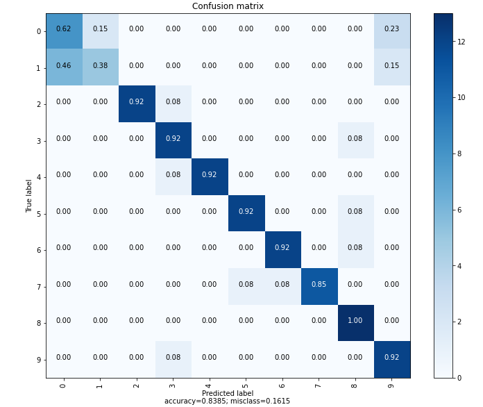
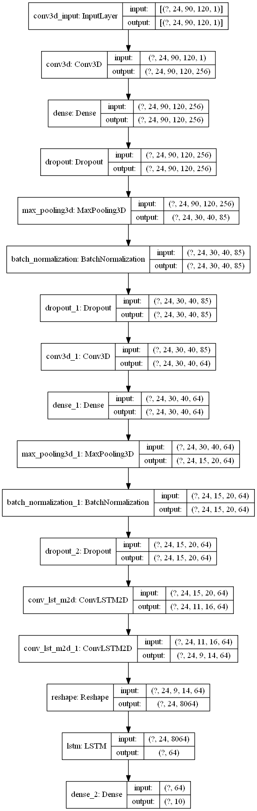

# Hand gesture recognition in industry
Scool project on a deep learning application.
DEVELOPPER L'INTRO

## Table of contents
* [Technologies](#Technologies)
* [How to use](#How-to-use)
* [Features](#Features)
* [Results](#Results)
* [Model](#Model)
* [Sources and inspirations](#Sources-and-inspiration)

## Technologies
Python 3.8.8
Tensorflow 2.3.0
Jupyterlab 2.2.6
Keras-visualizer 2.4
matplotlib 3.3.4
numpy 1.19.2
opencv 4.0.1
pandas 1.2.2
scikit-learn 0.24.1
scipy 1.6.1
python-graphviz 0.16

## How to use
Firstly, you can install the multiple packages mentioned above in [Technologies](#Technologies).
To use interface_predict.py, you need the model "model_12_90_120_acc83.h5" in "Saved_model".
In DATA, Video_example and labels_example.csv will be necessary to have a visualization of the multiple gestures. Labels_uses.csv is necessary to show the name of the predictions.
data_fab.py is necessary to create new gestures and new videos.

interface_predict.py is the main program of this project show a live video of the camera and give the prediction result.

## Features
DATA/data_fab.py can create short video with a specific amount of frame.
model_clean.ipynb is a notebook with the creation of the best model so far (accuracy of 83%)

## Results
Below is the confusion matrix of the best model so far. It was trained with 1476 videos.

## Model
Here is the structure of the model with an accuracy of 83%:

## Sources and inspirations
This project was inspired by
"Action Recognition in Video Sequences using Deep Bi-directional LSTM with CNN Features" by Students of the College of Software and Convergence Technology in Republic of Korea.
(This article is available in the Sources folder)
The model is inspired by the model presented in this article:
"Dynamic Hand Gesture Recognition Using 3DCNN and LSTM with
FSM Context-Aware Model" by Taiwan National Central University
(http://video.minelab.tw/gesture/)
